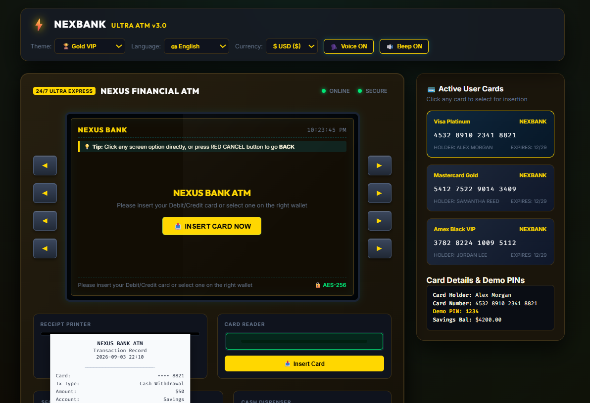

 # ⚡ NexBank CyberATM v3.0 - Next-Gen Interactive ATM Simulator
  

An advanced, hyper-realistic, interactive **ATM Machine Web Application** built with Vanilla HTML5, CSS3, and JavaScript. Designed with ultra-modern glassmorphic aesthetics, mechanical hardware audio feedback, Speech Synthesis AI Voice Guidance, multi-currency support, multi-language switching, and complete digital banking operations.

---

## 📸 Output Interface Screenshot

> *Tip: Place your live app screenshot inside `assets/preview.jpg` to display it on GitHub.*

---

## 🌟 Comprehensive Features Guide

### 🎛️ 1. Physical Hardware & Mechanical Simulation
- 💳 **Animated Card Reader Slot**: Real-time card insertion and ejection animations with glowing LED state lights (`Green = Ready`, `Red = In Use`).
- 🔢 **Tactile Metallic PIN Keypad**: High-contrast physical keypad with realistic press elevations, active button states, and full hardware keyboard support (`Numpad 0-9`, `Enter`, `Backspace`, `Esc`).
- 🔊 **Web Audio Synthesizer (Zero External Dependencies)**: Native HTML5 Web Audio API generating realistic mechanical clicks, keypress beeps, card insertion chimes, cash bill counting/crunching noises, error buzzers, and receipt printer whirring.
- 💵 **Animated Motorized Cash Dispenser**: Mechanical shutter doors open on cash withdrawal to present an animated stack of bills with one-click collection.
- 🧾 **Printable Paper Receipt Printer**: Paper slot ejects a physical-feel printed receipt complete with transaction ref number, timestamp, account details, and instant **Print to PDF / Browser Print** support.

---

### 🧠 2. Smart Banking & Financial Operations
- 🔐 **PIN Authentication & Security**: 4-digit PIN security check with 3-attempt lock & auto-card ejection protection.
- 💰 **Real-Time Balance Inquiry**: Check live account balance for Savings and Checking accounts.
- 💸 **Cash Withdrawal (Presets + Custom)**:
  - Quick withdrawal presets: **$20**, **$50**, **$100**, **$200**, **$500**.
  - **Custom Amount**: Enter any amount in multiples of 10 with real-time balance validation.
- 📥 **Envelope-Free Cash Deposit Feeder**: Interactive cash note feeder modal allowing selection of **$10**, **$20**, **$50**, **$100**, and **$500** bills to deposit into account balance.
- 🔁 **Beneficiary Fund Transfer**: Send money directly to any 10-digit bank account number with instant balance deduction and printed transaction receipt.
- 📱 **Mobile & DTH Recharge**: Select mobile recharge plans ($15, $29, $49, $99) and recharge mobile numbers directly from ATM funds.
- 📋 **Mini-Statement Feed**: View recent 3-5 timestamped transaction history logs (Withdrawals, Deposits, Transfers, Recharges).
- 🔑 **PIN Change Utility**: Update and replace card PIN securely on-the-fly.

---

### 🗣️ 3. AI Voice Assistant & Multi-Language Support
- 🗣️ **Speech Synthesis Voice Assistant**: Integrated AI Voice Guidance speaking screen directions and confirmations in real time (*"Welcome Alex Morgan"*, *"Please enter your 4-digit PIN"*, *"Cash dispensing in progress"*).
- 🌐 **Instant Multi-Language Switcher**:
  - 🇬🇧 **English**
  - 🇮🇳 **हिन्दी (Hindi)**
  - 🔤 **Hinglish**
  - Switches all screen text, button prompts, and status messages live without reloading the page.

---

### 💱 4. Multi-Currency & Theme Customization
- 💱 **Live Multi-Currency Toggle**: Switch currency symbols seamlessly between **$ USD ($)**, **₹ INR (₹)**, and **€ EUR (€)** across all screens, receipts, and deposit modals.
- 🎨 **Multi-Theme Casing Switcher**:
  - 🌌 **Cyber Neon**: Cyberpunk dark obsidian chassis with neon cyan and emerald glowing accents.
  - 🏆 **Gold VIP**: Luxurious black chassis with metallic gold highlights.
  - 🛡️ **Classic Steel**: Corporate navy blue brushed steel finish.

---

### 🖱️ 5. Intuitive User Experience & Back Navigation
- 👆 **Direct Screen Touch/Click Controls**: Every menu button shown on screen is directly clickable with your mouse cursor.
- 🔴 **Dedicated Back Navigation**: Prominent **`◄ BACK TO MAIN MENU`** buttons on every sub-screen, plus Red Keypad **CANCEL** button and Keyboard **`Esc`** key for effortless navigation.

---

## 🔑 Demo Cards & Security Credentials

Pick any card from the interactive right-side Wallet Panel:

| Cardholder Name | Card Type | Card Number | Demo PIN | Initial Balance |
| :--- | :--- | :--- | :--- | :--- |
| **Alex Morgan** | Visa Platinum | `4532 8910 2341 8821` | **`1234`** | \$4,250.00 |
| **Samantha Reed** | Mastercard Gold | `5412 7522 9014 3409` | **`8888`** | \$9,800.50 |
| **Jordan Lee** | Amex Black VIP | `3782 8224 1009 5112` | **`0000`** | \$25,000.00 |

---

## ⌨️ Hardware Keyboard Controls

| Physical Key | Function |
| :--- | :--- |
| **`0` - `9`** | Input PIN digits & Custom withdrawal/transfer amounts |
| **`Enter`** | Green ENTER (Confirm PIN / Action) |
| **`Backspace` / `Delete`** | Yellow CLEAR (Erase last digit) |
| **`Escape` (Esc)** | Red CANCEL (Go Back to Main Menu / Eject Card) |

---

## 🚀 Quick Start Guide

1. Download or clone this repository:
## Live link

**https://atm-simulator-machine-project.netlify.app/**
